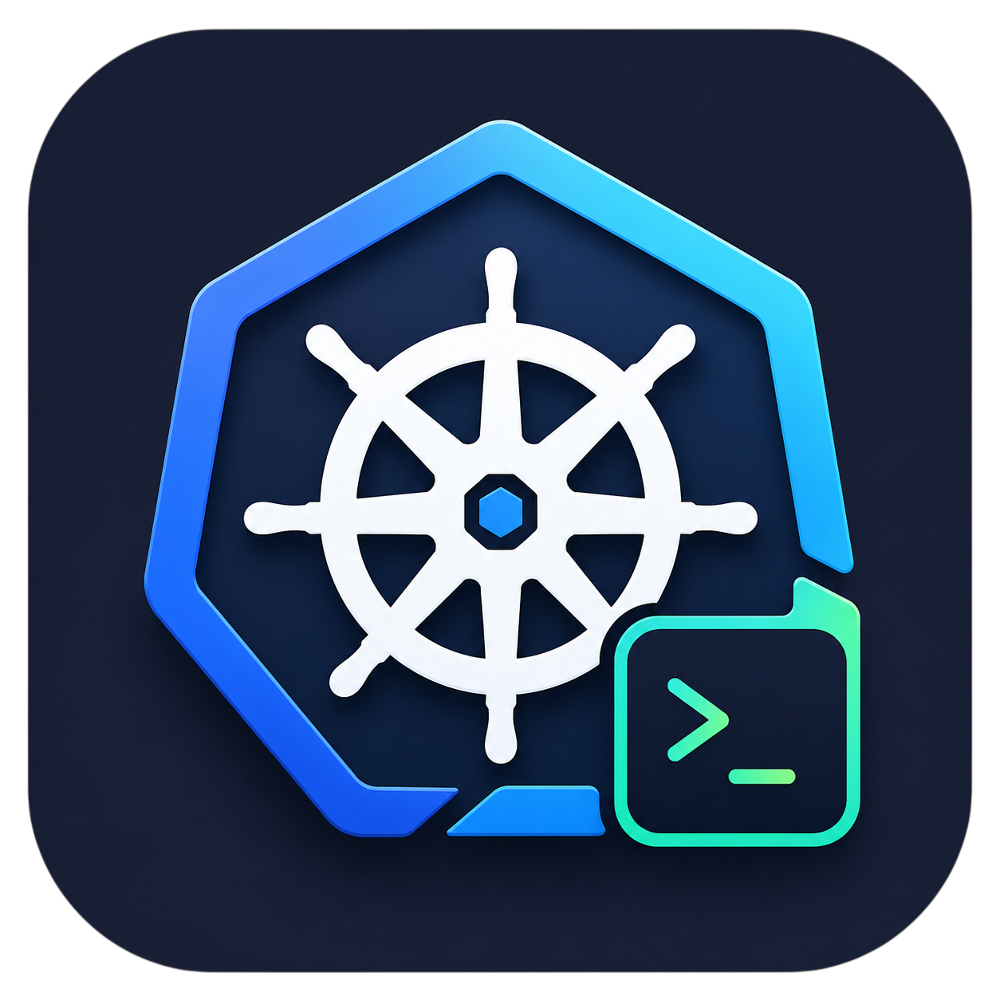

# MagicLens

**A fast, native desktop client for Kubernetes.**

Find every cluster in your kubeconfig, open them in tabs, and work across them
without leaving one window.

---

## Install

Download the latest build for your platform from the
**[releases page](https://github.com/magicorntech/magiclens/releases/latest)**.

| Platform | File |
|---|---|
| macOS (Apple Silicon) | `MagicLens-<version>-arm64.dmg` |
| macOS (Intel) | `MagicLens-<version>.dmg` |
| Windows | `MagicLens-Setup-<version>.exe` |
| Linux | `MagicLens-<version>.AppImage` or `.deb` |

macOS builds are signed with a Developer ID certificate and notarized by Apple, so
they open without a Gatekeeper warning and update themselves in place.

### Staying up to date

MagicLens checks for a new release on startup and periodically after that. Once one's
found, it downloads in the background — nothing is installed without asking first. A
small arrow badge appears next to the app name in the sidebar; click it for
**Install Update Now** (once the download's ready) and **View Release Notes**. The
same update is also announced by a toast in the bottom-right corner, with the option
to skip a version or be reminded later. All three platforms get this automatically;
on macOS it works because releases are signed and notarized.

## What it does

**Multi-cluster by default.** MagicLens scans your kubeconfig files, lists every
context it finds, and lets you connect to several at once. Clusters open as tabs, and
you can group them into *workspaces* — each one gets its own name, logo and accent
colour, so a busy tab bar or sidebar stays readable at a glance.

**Browse and edit any resource.** Built-in kinds get purpose-built tables with live
watches, and anything else — CRDs, operator resources — is browsable through the same
interface. Edit YAML in place, apply, or delete.

**Workloads.** Scale, restart, pause and resume rollouts, roll back to a previous
revision, change an image, suspend a CronJob, trigger a Job.

**Logs, shells and forwarding.** Stream pod logs, open a shell in a container or on a
node, and run port-forwards to pods and services from a panel that keeps track of
what's open.

**Helm.** See what's installed, inspect a release's values and resources, review its
history, roll back, or uninstall.

**Argo CD.** A dashboard over the `argoproj.io` CRDs: application health and sync
state, application sets, and projects. Open an application to see its resource tree,
edit or delete resources from the drawer, and browse the repository and cluster
registries. Sync or refresh applications individually or in bulk. Reads through your
existing cluster connection — no Argo API server URL or token needed.

**Metrics.** Node and pod usage from metrics-server, with richer history and range
queries when a Prometheus is reachable.

**Topology.** A live graph of how workloads, services and ingresses connect.

**Sparks.** A local markdown vault for notes, checklists and reminders, so the context
around an incident lives next to the cluster it concerns.

**Menu-bar widget** *(macOS)*. Cluster health, CPU, memory and pod counts in the menu
bar, with a popup for the clusters you pick.

**VPN.** Bring up a VPN profile and tie it to a cluster, so connecting to the cluster
brings up the tunnel it needs.
