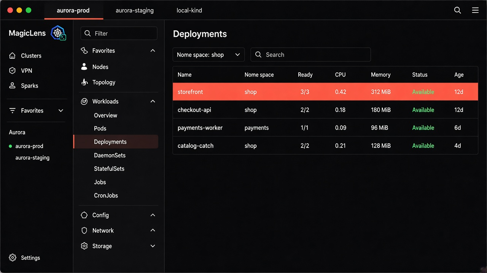
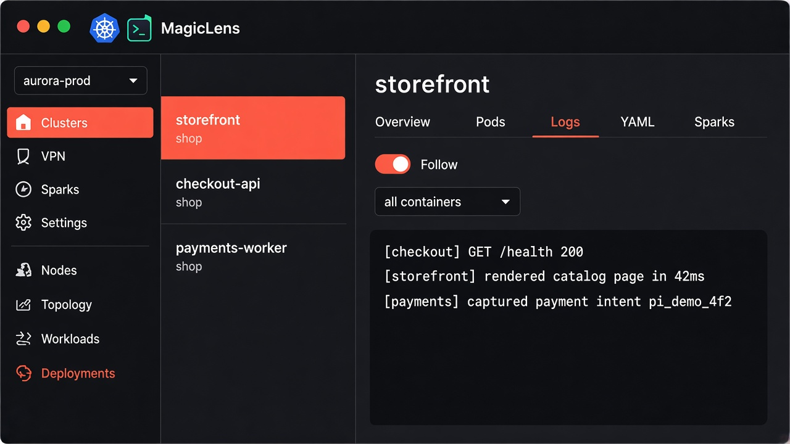
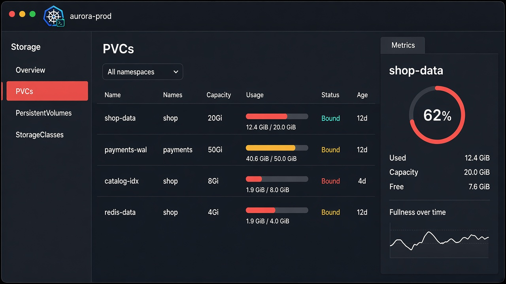
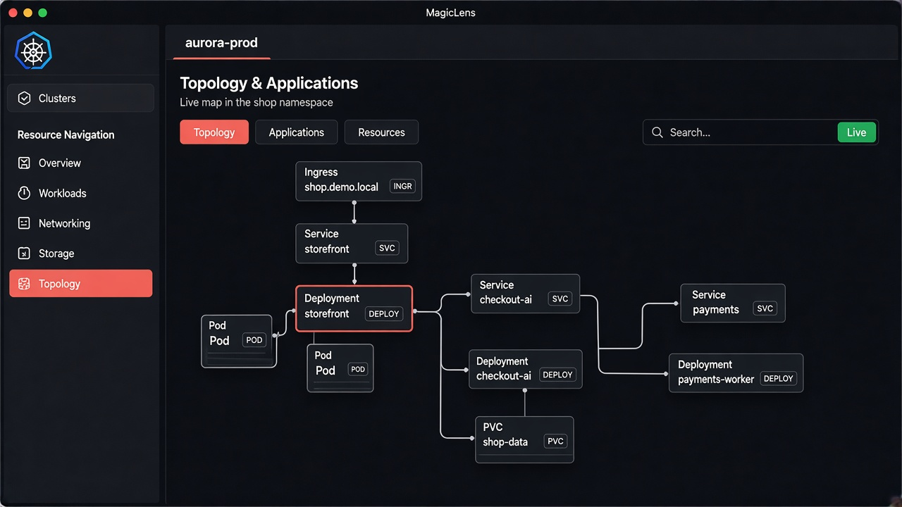

# MagicLens

**A native Kubernetes desktop for macOS, Windows, and Linux.**

Every cluster in one window — browse, debug, and operate without leaving the desktop.

 

[Latest release](https://github.com/magicorntech/magiclens/releases/latest) ·
[All versions](https://github.com/magicorntech/magiclens/releases) ·
[Support](mailto:support@magicorn.co)

  

---

## Download

MagicLens ships as **signed desktop installers**. Get the app from a **GitHub Release** — each version is a tag (`v0.1.25`, …). There is no source checkout and nothing to build.

**[Download the latest release →](https://github.com/magicorntech/magiclens/releases/latest)**

| You use | Install this file |
| --- | --- |
| macOS, Apple Silicon | `MagicLens-<version>-arm64.dmg` |
| macOS, Intel | `MagicLens-<version>.dmg` |
| Windows | `MagicLens-Setup-<version>.exe` |
| Linux | `MagicLens-<version>.AppImage` or `.deb` |

Older versions live on the same [Releases](https://github.com/magicorntech/magiclens/releases) page, one tag per build.

macOS builds are Developer ID signed and notarized. After you install, MagicLens checks for new tags in the background — you choose when to apply an update.

### After install

1. Open MagicLens and add a kubeconfig (file or folder).
2. Open a cluster tab.
3. Use the sidebar — Deployments, Pods, Storage, Helm, Argo CD, Visualizer, Timeline.

---

## Why MagicLens

- **Local-first** — Talks to the Kubernetes API with your kubeconfig. Cluster data stays on your machine.
- **Multi-cluster** — Several contexts as tabs. Workspaces with names, logos, and accents. Cloud provider logos (AWS, GCP, Azure, Huawei) when the kubeconfig gives them away.
- **Operate, don’t just watch** — Scale, restart, roll back, exec, forward ports, sync Argo apps, manage Helm — from the same UI.

---

## Highlights

**Clusters & workspaces**  
Scan kubeconfig files or folders. Connect many clusters at once. Favorites, resizable sidebars, light / dark / system themes, and named custom accents.

**Resource explorer**  
Live-watched tables for workloads, config, network, storage, RBAC, and CRDs. Namespace filter, global search (⌘K / Ctrl+K), YAML edit / apply / delete.

**Workloads**  
Scale, restart, pause or resume rollouts, roll back, change images, run or suspend Jobs and CronJobs. Pods, aggregated logs, events, and notes on one detail view.

**Logs, exec & terminals**  
Follow and download logs, including merged workload logs. Exec into containers or nodes. Local terminals and a YAML scratch editor from the quick-actions control.

  

**Port forwarding**  
Forward pods and services; keep active tunnels in one panel. Idle forwards can close themselves.

**Storage & metrics**  
PVC used / capacity / % full when Prometheus scrapes kubelet volume stats. Node and pod CPU/memory from metrics-server; history, disks, and pressure with Prometheus.

  

**Topology & Visualizer**  
A live graph of workloads, services, ingresses, and volumes in a namespace — plus a cluster-wide Visualizer map grouped by namespace and Helm release.

  

**Timeline**  
Recent cluster events as a Gantt, filterable by namespace.

**Helm**  
Releases, values, resources, history, rollback, uninstall, and a chart catalog.

**Argo CD**  
Health, sync, ApplicationSets, projects, repos, and clusters via `argoproj.io` CRDs — no extra Argo API URL or token.

**Sparks**  
A local Markdown vault (notes, sketches, reminders) next to the cluster and resource they belong to.

**VPN**  
Attach OpenVPN, Pritunl, or WireGuard profiles so connecting a cluster can bring the tunnel up.

**macOS menu bar**  
Cluster health, CPU, memory, and pod counts for the clusters you pin.

---

## Requirements

| Need | For |
| --- | --- |
| A kubeconfig on disk | Cluster access |
| metrics-server | Live CPU / memory |
| Prometheus *(optional)* | History, node disks, PVC fullness (`kubelet_volume_stats_*`) |
| OpenVPN Community CLI or WireGuard *(optional)* | PIN + MFA tunnels — OpenVPN Connect is not supported |

UI languages: English, Türkçe, Deutsch, Français, 日本語, 한국어, 中文.

---

## Privacy

MagicLens uses your existing kubeconfig credentials against the cluster API. It does not upload cluster data to Magicorn unless you opt into a hosted account feature.

---

## Support

Questions and issues: [support@magicorn.co](mailto:support@magicorn.co)

Installers and past versions: [github.com/magicorntech/magiclens/releases](https://github.com/magicorntech/magiclens/releases)
