

# MagicLens

**A native Kubernetes desktop for macOS, Windows, and Linux.**

Every cluster in one window — browse, debug, and operate without leaving the desktop.

 

[Latest release](https://github.com/magicorntech/magiclens/releases/latest) ·
[All versions](https://github.com/magicorntech/magiclens/releases) ·
[Support](mailto:support@magicorn.co)

  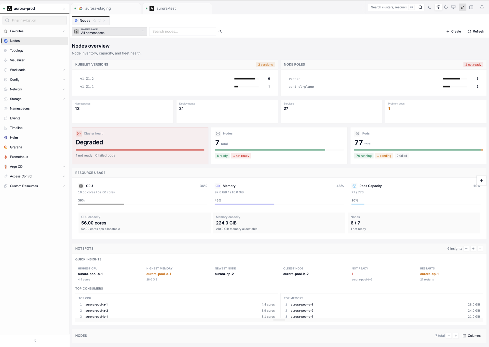

  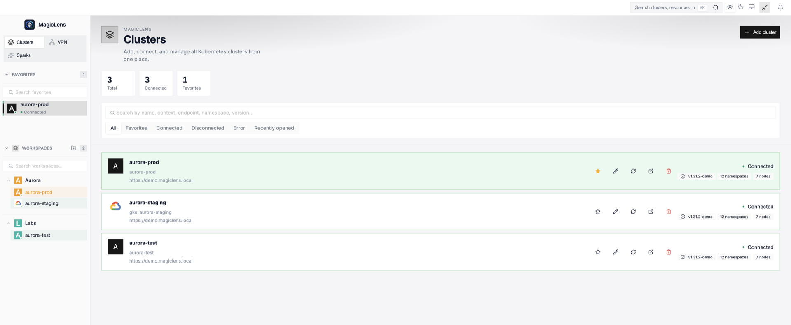

---

## Download

MagicLens ships as **signed desktop installers**. Get the app from a **GitHub Release** — each version is a tag (`v0.1.25`, …). There is no source checkout and nothing to build.

**[Download the latest release →](https://github.com/magicorntech/magiclens/releases/latest)**

| You use | Install this file |
| --- | --- |
| macOS, Apple Silicon | `MagicLens-<version>-arm64.dmg` |
| macOS, Intel | `MagicLens-<version>.dmg` |
| Windows | `MagicLens-Setup-<version>.exe` |
| Linux | `MagicLens-<version>.AppImage` or `.deb` |

Older versions live on the same [Releases](https://github.com/magicorntech/magiclens/releases) page, one tag per build.

macOS builds are Developer ID signed and notarized. Windows installers are Authenticode-signed. After you install, MagicLens checks for new tags in the background — you choose when to apply an update.

### After install

1. Open MagicLens and add a kubeconfig (file or folder). The default scan path is `~/.kube`; you can point it at any file or directory.
2. Connect a cluster and open it as a tab.
3. Use the sidebar — Nodes, Workloads, Storage, Helm, Argo CD, Visualizer, Timeline, and the rest of the cluster.

---

## Why MagicLens

- **Local-first** — Talks to the Kubernetes API with your existing kubeconfig. Cluster data stays on your machine. Nothing is uploaded unless you opt into a hosted account feature.
- **Multi-cluster, one window** — Several contexts as tabs. Workspaces with names, logos, and accents. Split view for staging vs production. Cloud provider logos (AWS, GCP, Azure, Huawei) when the kubeconfig gives them away.
- **Operate, don’t just watch** — Scale, restart, roll back, change images, exec, tail logs, forward ports, sync Argo apps, install or roll back Helm — from the same UI.
- **See the shape of the cluster** — Nodes overview, Visualizer map, Topology graph, and an event Timeline sit next to the live tables.

---

## Clusters

Scan a kubeconfig file or a folder of configs. The default path is `~/.kube`; Settings can point at any file or directory. Connect many clusters at once, pin favorites, and keep each context as a tab with its own namespace filter and last-opened resource. Duplicate contexts that share the same API server and credentials can be merged into one entry.

Cluster avatars use your custom logo when you set one. Otherwise MagicLens reads the kubeconfig (server URL, context name, exec plugin) and shows AWS, Google Cloud, Azure, or Huawei when it can tell.

  

### Cluster settings

Every cluster has its own **Edit Cluster** sheet — search the sections, then save. Settings stay with that context, not the whole app.

**Appearance.** Display name and a custom logo (otherwise the letter tile or the detected cloud mark). Workspace background: ten built-in landscapes (Alpine Dawn, Ocean Horizon, Forest Mist, …) or upload PNG/JPEG. Panel transparency controls how see-through tables and menus are over the wallpaper.

**General.** Read-only identity from the kubeconfig: context, API server, Kubernetes version, cluster id, connection status, last opened. Then tags, environment (`dev` / `staging` / `prod`), and free-text notes.

**Proxy.** Optional HTTP/HTTPS proxy for API traffic, no-proxy hosts, basic auth, and failover to an alternate endpoint. Link a VPN profile so opening the cluster tab can bring the tunnel up; PIN and MFA stay on that profile.

**Terminal.** Default shell, working directory, default namespace, sync `KUBECONFIG` / context on open, history, auto-complete, RBAC hints, multi-tab, extra `KEY=value` environment.

**Namespaces.** Default namespace, pinned namespaces at the top of the selector, RBAC-based filtering, label grouping.

**Metrics.** Prometheus source: auto-detect (API-server Service proxy) or a custom URL. Scrape interval, query timeout, HTTPS, authentication, path prefix, hide unused series, and Test / rediscover.

**Node shell.** Privileged debug pod for `nsenter` on a node: image, pull policy / secret, CPU and memory limits, privileged / root, node selector, tolerations, cleanup TTL.

**Integrations.** Auto-detect Grafana, Prometheus, and Argo CD Services. Leave the URL blank to port-forward in-cluster; paste an external URL to open that instead.

Also per cluster: Lens Metrics (optional in-cluster stack), security (RBAC viewer, encrypt kubeconfig at rest, client audit), network notes (domain, CIDRs), storage defaults, performance (rate limit, cache, refresh, concurrency), UI density, and debug flags. The kubeconfig itself can be viewed, copied, or edited and saved for this cluster — reconnect to apply.

  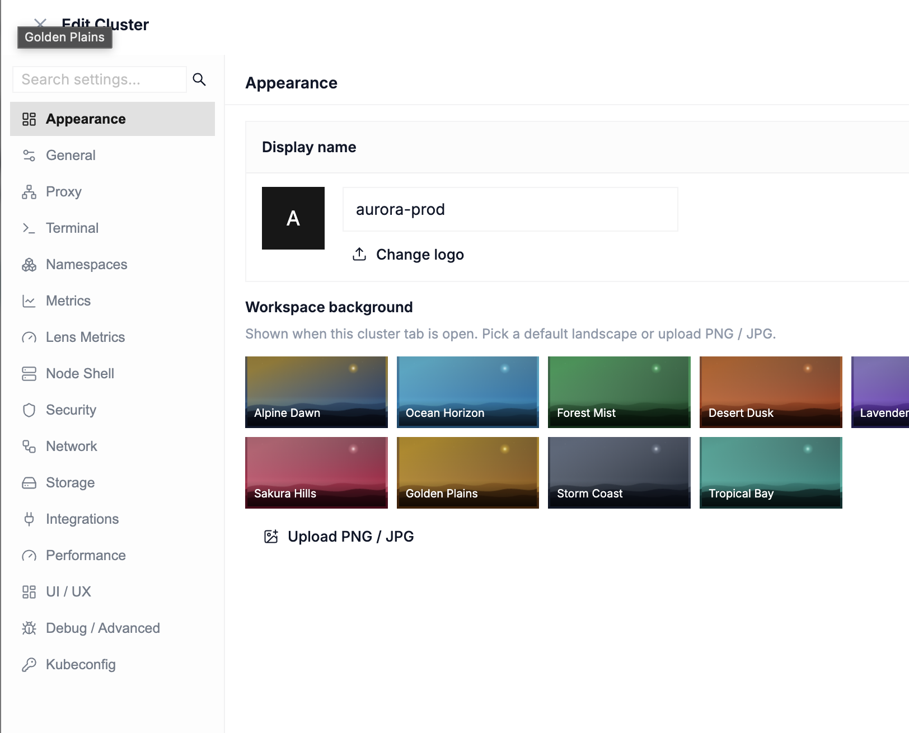

  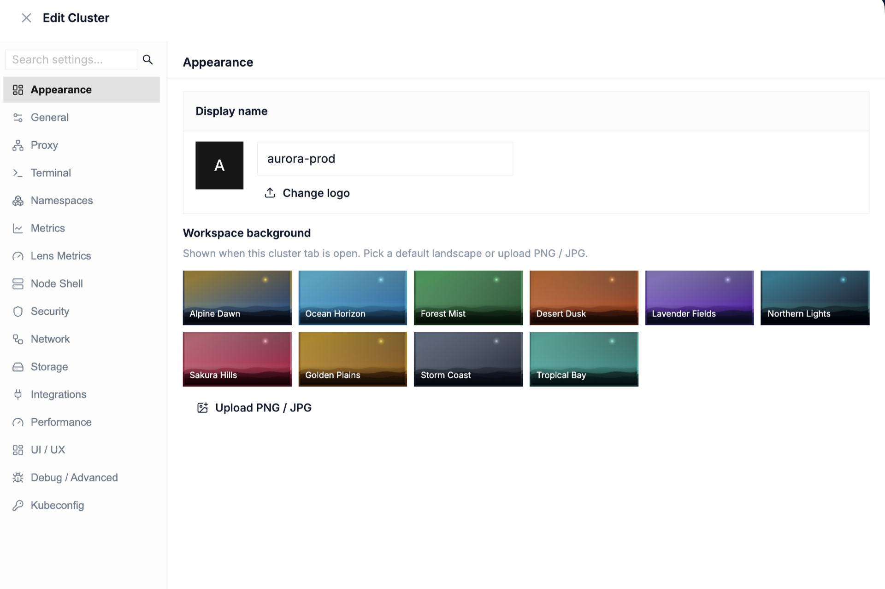

  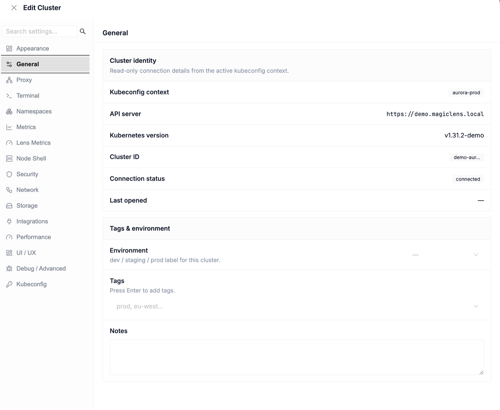

  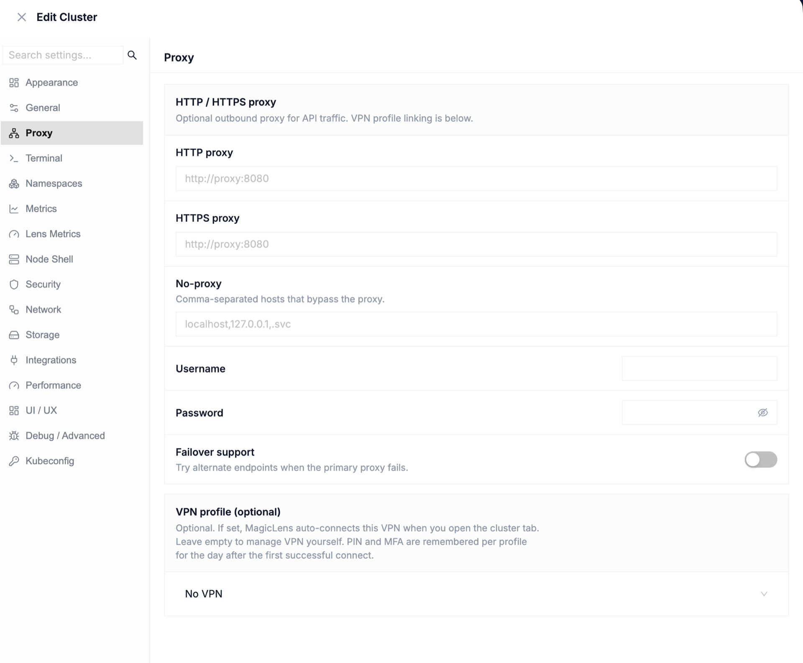

---

## Workspaces

Workspaces group clusters the way your org actually works — production vs labs, a region, a product line. The sidebar lists every workspace, searchable, expandable, with a count in the header. Create one with **+**, then assign clusters. A cluster can live in a workspace; opening the workspace expands it and opens those clusters as tabs.

**Name & logo.** Give the workspace a title and a square logo (or keep the letter tile). The logo appears in the sidebar next to every cluster in that group.

**Colour.** Amber, blue, green, purple, pink, teal, red — or none. The accent tints the workspace header and its clusters so Aurora and Payments do not look the same at a glance. The same palette is used in the macOS menu-bar widget so a workspace and its cards stay one colour everywhere.

**Clusters.** Multi-select which contexts belong here. Add or remove them later from Edit workspace. An empty workspace still shows in the list so you can fill it when the kubeconfig arrives.

**Keyboard shortcut.** Assign `⌘`/`Ctrl` (or `Alt`) plus a key. That shortcut expands the workspace and opens its clusters. The same bindings are listed under Settings → Keyboard. Conflicting shortcuts swap automatically. Clear the binding if you only want the mouse.

**Sidebar.** Collapse a workspace to hide its clusters. Collapse the whole Workspaces section in Settings → Display. Hover menus on the workspace header cover edit and delete. Search filters workspace names as you type.

  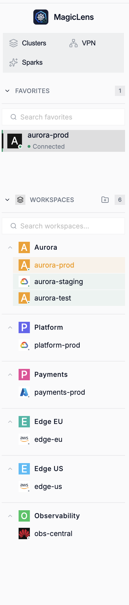

  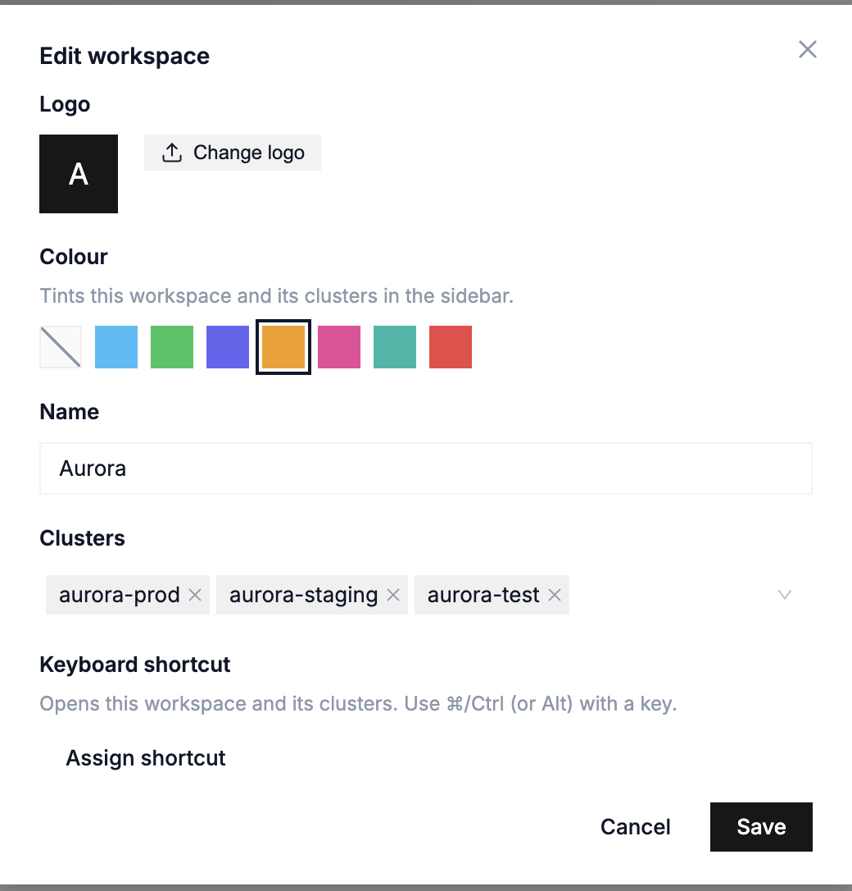

  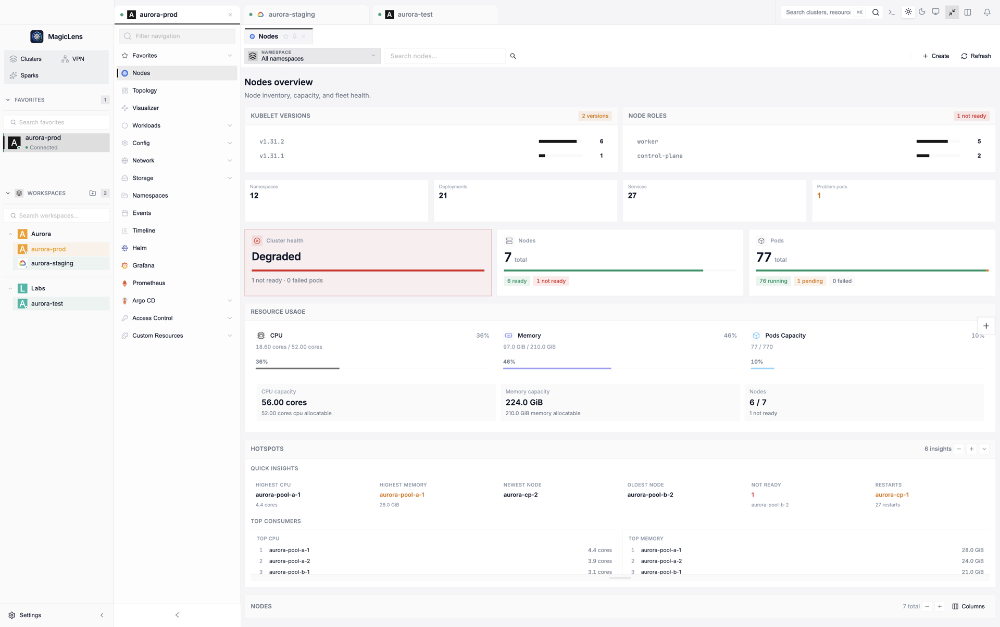

---

## Nodes overview

The Nodes page is a fleet dashboard, not only a table. Kubelet versions, roles, ready / not-ready counts, CPU and memory capacity vs usage, pod capacity, and hotspots (highest CPU, highest memory, newest and oldest nodes, restart leaders) sit above the node list.

You can hide or reorder those sections and switch them between full and half width. One not-ready node turns the health strip to Degraded so you see it before you scroll.

  

---

## Resource explorer

Live-watched tables for the Kubernetes objects you work with every day. Namespace filter (all, pinned, system, apps), column picker, search, YAML edit / apply / delete, and a detail view that can open as a right drawer, a split panel, or a bottom tab.

**Workloads** — Pods, Deployments, StatefulSets, DaemonSets, ReplicaSets, ReplicationControllers, Jobs, CronJobs.

**Config** — ConfigMaps, Secrets, ResourceQuotas, LimitRanges, HorizontalPodAutoscalers, PodDisruptionBudgets, PriorityClasses, RuntimeClasses, Leases, admission webhooks and validating admission policies.

**Network** — Services, Endpoints, EndpointSlices, Ingresses, IngressClasses, NetworkPolicies.

**Storage** — PersistentVolumeClaims, PersistentVolumes, StorageClasses.

**Access** — ServiceAccounts, Roles, RoleBindings, ClusterRoles, ClusterRoleBindings.

**Custom resources** — CRDs and live instances on one page (All / Installed), plus discovered API groups and versions.

Global search (`⌘K` / `Ctrl+K`) jumps to clusters, namespaces, and resources. Bindings are editable in Settings → Keyboard; conflicting shortcuts swap automatically.

  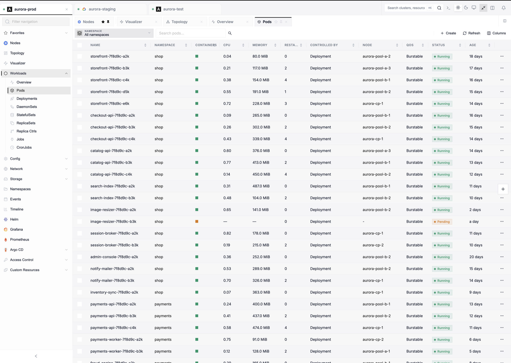

  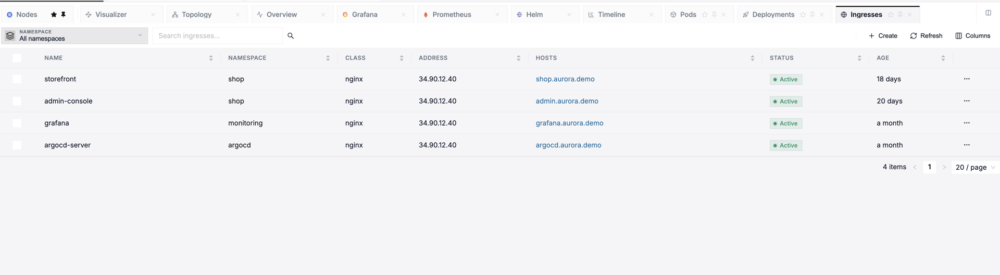

---

## Workloads & pods

Scale a Deployment or StatefulSet, restart a rollout, pause or resume it, roll back to a previous ReplicaSet, or change a container image. Run or suspend Jobs and CronJobs. Batch-delete pods when you need a clean reschedule.

Open a pod and you get overview, containers, metrics, network (services and ports), logs, exec, events, Sparks notes, and YAML in one place. The overview shows phase, ready, restarts, node, IPs, QoS, owner, conditions, and scheduling.

  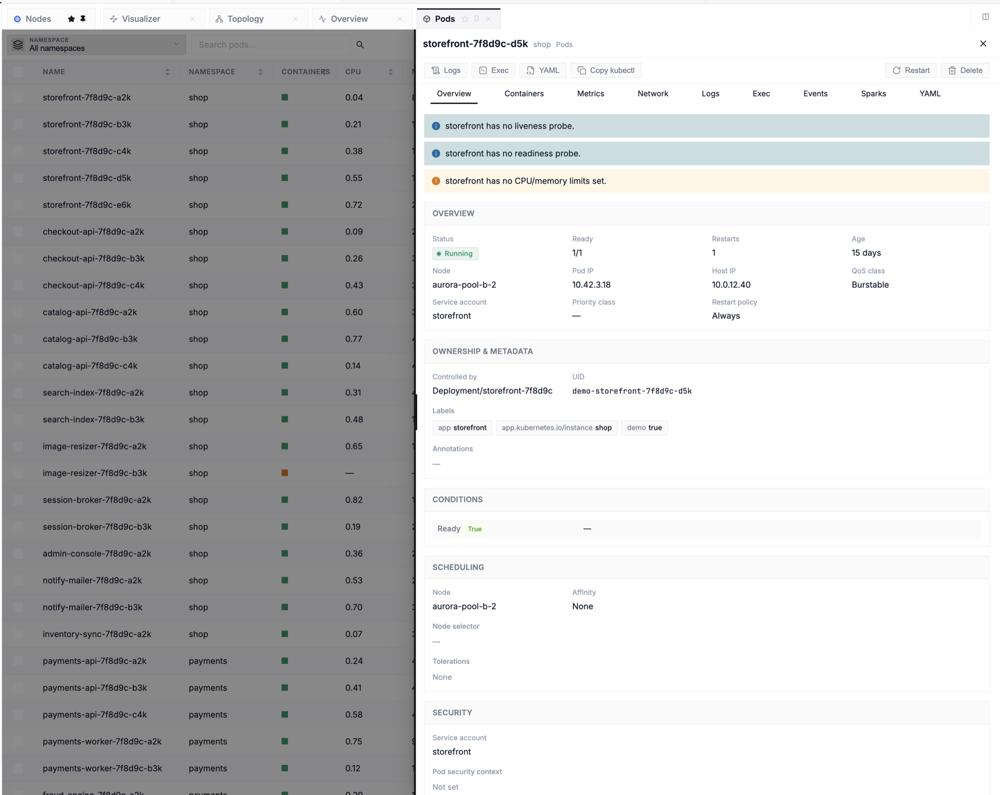

---

## Logs

Open Logs on a Pod or on a Deployment. A workload view merges every replica into one stream (`All pods`) so you can follow `storefront` without opening five containers. Pick a single pod when you need to isolate a crash.

Tail length (100 / 500 / …), timestamps, previous instance, wrap, follow, filter, and download. Restart the stream without leaving the panel. The same toolbar sits on the resource detail drawer and in split view.

  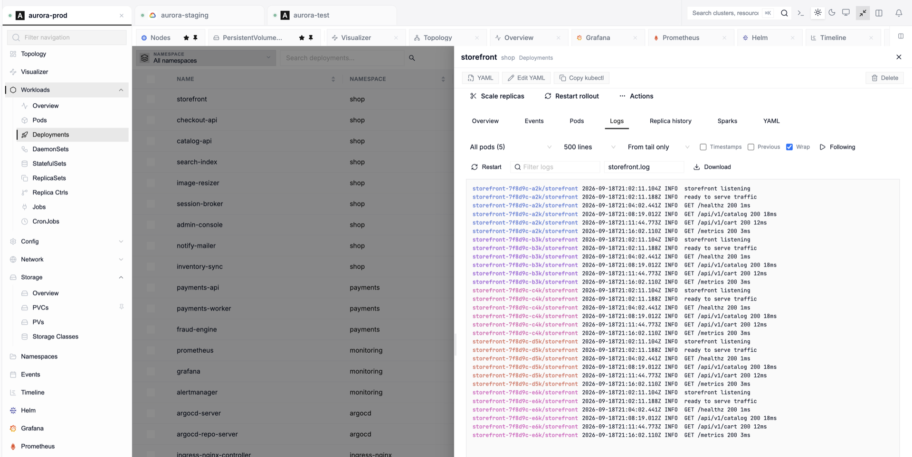

  

## Exec & terminals

Exec is an interactive shell inside the container — stdin, resize, and a reconnect button if the session drops. Node shell is available from cluster settings when you need the host.

Local terminals inherit that cluster’s kubeconfig context, default namespace, and optional extra environment. A YAML scratch editor sits next to the terminal so you can draft a manifest without opening another app. The Terminal / YAML dock can sit at the bottom, right, or left. A quick-actions balloon (terminal, blank YAML, new Spark) parks on a corner — or drag it anywhere.

  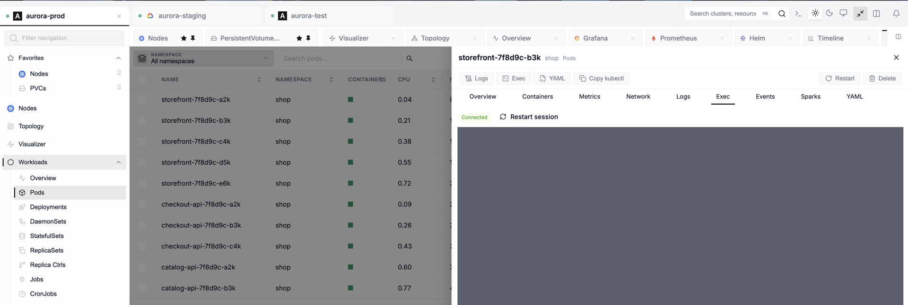

---

## Storage & metrics

The Storage sidebar has an overview plus PVCs, PVs, and StorageClasses. The PVC table lists capacity, used bytes, percent full, Bound status, and age. Bars turn amber when a volume is filling up so you see `catalog-idx` at 78% before it pages.

Open a claim for a Metrics tab: used / capacity / free, a fullness bar, volume fullness over time, and bytes used over time. Those series need Prometheus scraping `kubelet_volume_stats_*`. PersistentVolumes and StorageClasses (provisioner, reclaim policy) sit next to the claims.

Live CPU and memory on nodes and pods come from metrics-server. Historical charts, disk fullness, and node pressure need Prometheus — auto-discovered through the API-server Service proxy, or a URL on the cluster. If Prometheus is missing, live metrics still work; history stays empty.

  

  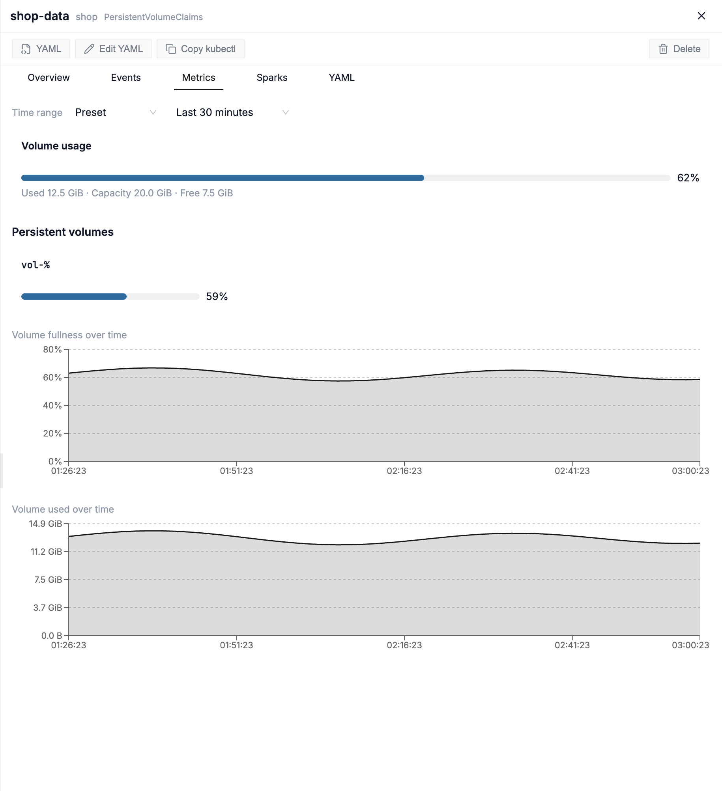

  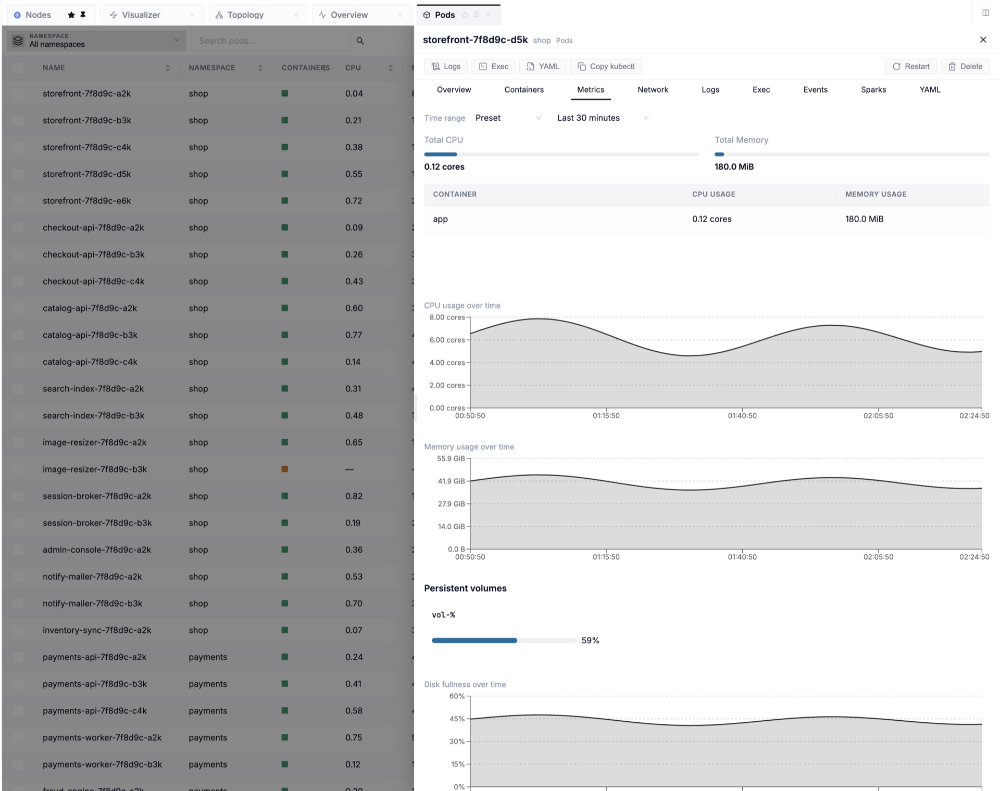

---

## Visualizer & Topology

**Visualizer** is a cluster-wide map. Namespaces and Helm releases become groups; workloads and services become cards with brand icons from the container image (nginx, postgres, redis, Argo, Grafana, …). Ingress and egress marks sit on the card. Click a card for the full resource drawer. Visualizer is its own page — Topology stays in the sidebar.

**Topology** is a live map of one namespace: how a Deployment owns a ReplicaSet, how that ReplicaSet owns Pods, how a Service selects those pods, how an Ingress routes to the Service, and how pods mount ConfigMaps. Edges are labelled owns / selects / routes / mounts. Health colours follow ready replicas (a 1/2 Deployment is degraded).

Three modes:

- **Topology** — the graph, with a minimap and Insights (crash loops, empty services, orphan ingresses, zero-ready workloads).
- **Applications** — cards grouped by `app` / `app.kubernetes.io/instance`, with replica summary and error count. Click a card to focus that subgraph.
- **Resources** — a filterable table (name, kind, health, replicas, age) of the same nodes.

Pick a concrete namespace (`shop`, `payments`, `data`). All namespaces is disabled — the graph would be too large. Open the graph in a separate window if you want it on a second display.

  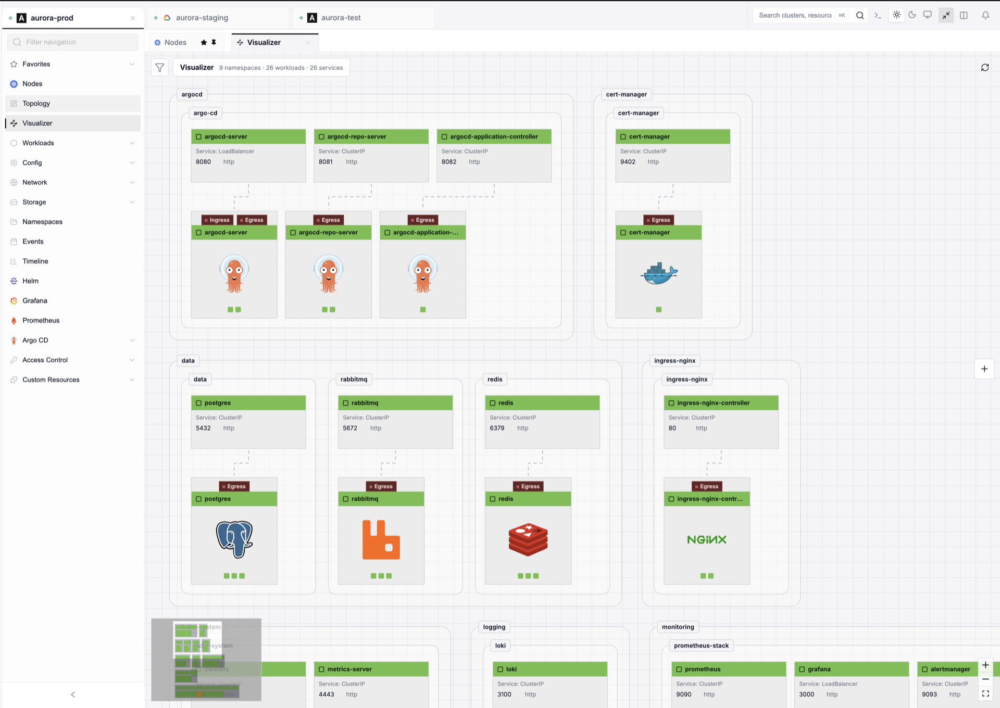

  

  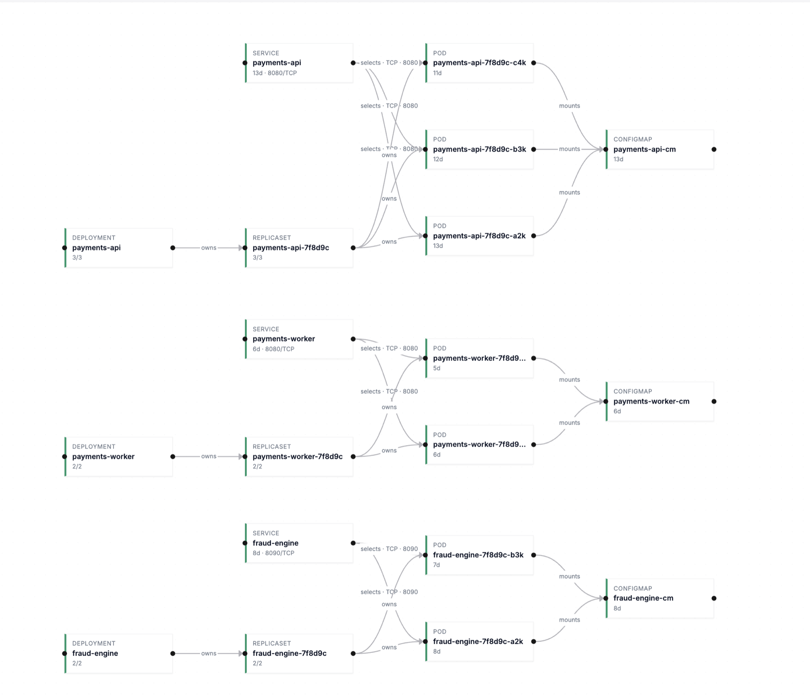

  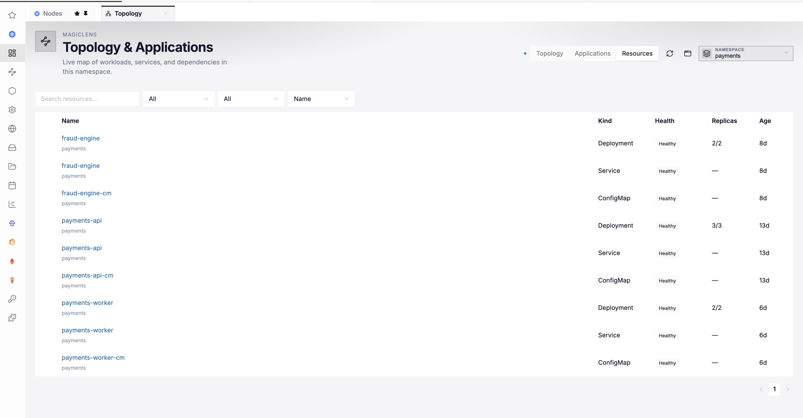

---

## Timeline

Recent namespaced events as a Gantt, grouped by the object they belong to (Deployment, Pod, Job). Filter by namespace, kind, warning vs normal, and a search over reason / message. The density strip on top shows when the cluster was noisy. Hover a bar for reason, message, and count — the same stream as `kubectl get events`, laid out in time instead of a dump. A 30-minute window is the default; zoom the axis when you need a longer stretch.

  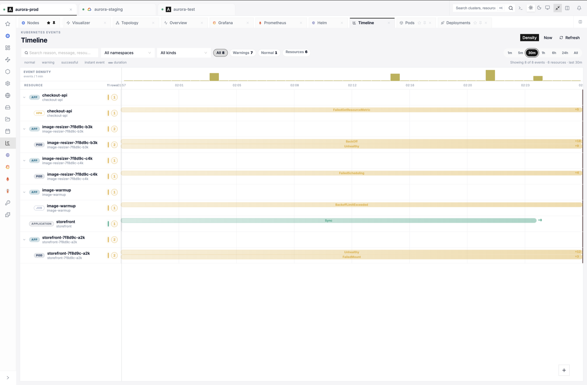

---

## Helm

One page, two tabs: **Charts** and **Releases**.

The catalog searches known repos. Open a chart for description, versions, prerequisites, and values YAML; set a release name and namespace, then deploy. Installed charts also appear as a summary (how many releases, which namespaces).

A release opens notes, owned resources (Deployment / Service / ConfigMap), history, values, rollback, upgrade, and uninstall. Demo and live clusters use the same editor so a values tweak and a rollback stay in one place.

  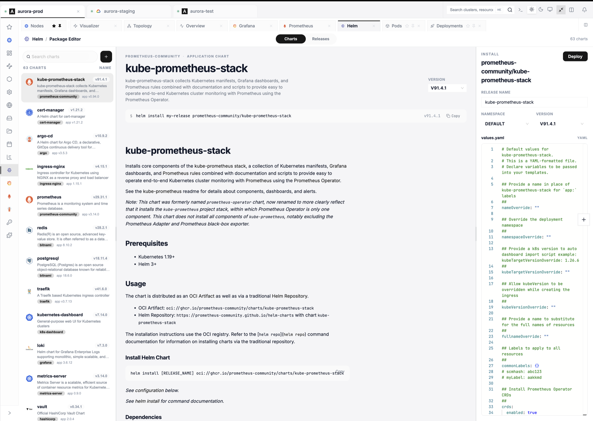

  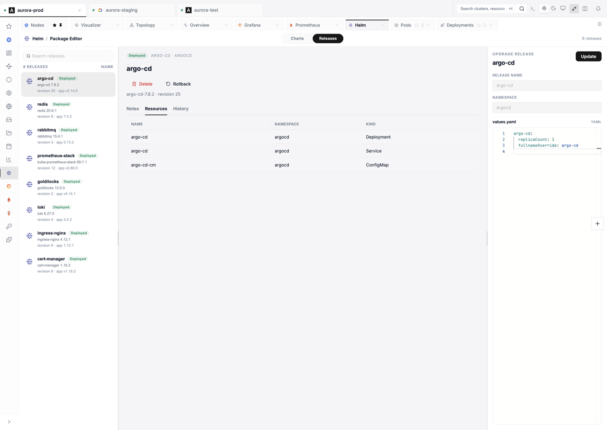

---

## Argo CD, Grafana & Prometheus

Argo CD is first-class in the sidebar: dashboard, Applications, ApplicationSets, projects, repositories, and clusters, read from `argoproj.io` CRDs. Sync or refresh one app or many — no extra Argo API URL or token.

**Web UI** opens the in-cluster Argo / Grafana / Prometheus Service through a local port-forward (or a URL you set). Credentials are read from a Secret when MagicLens can find them; you can also paste username and password. The toolbar shows the forwarded address and Open / Refresh. Sessions stay alive while the tab is open.

If the Service is missing, Edit Cluster → Integrations lets you save an external URL and try again.

  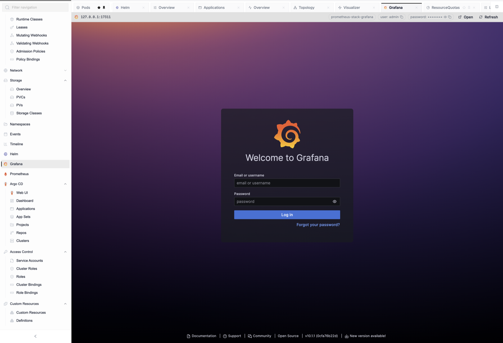

  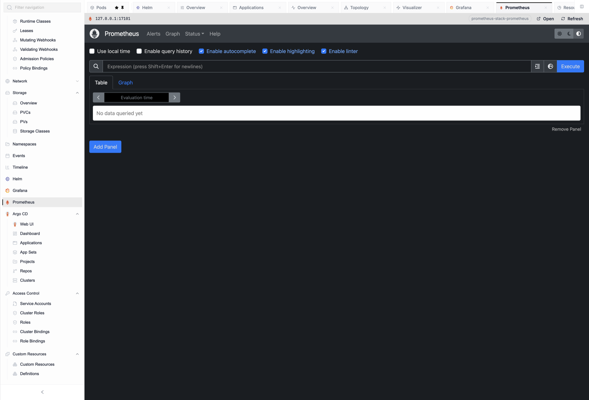

  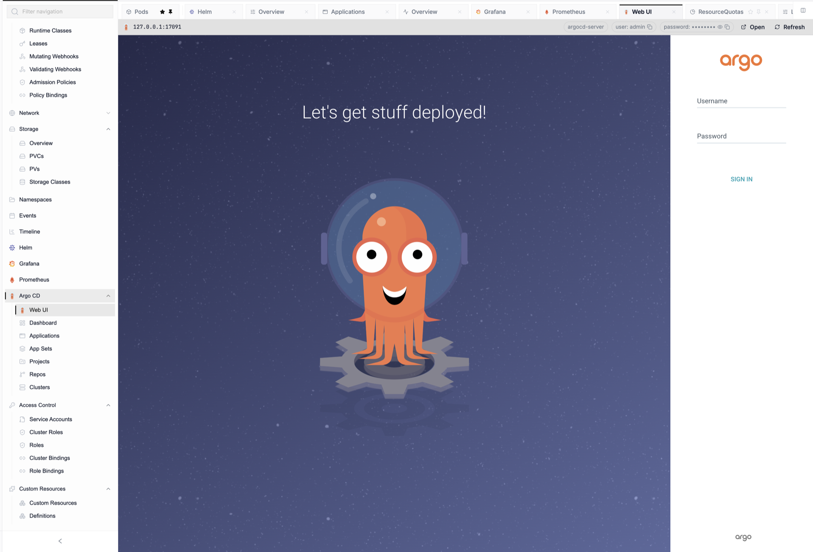

---

## Port forwarding

Forward a Pod or Service to a local port from the resource detail (Port Forward tab) or from the Service table. MagicLens picks a free local port unless you set one. Every open tunnel — across all clusters — is listed in Settings → Port Forwarding; stop any of them from there.

Idle forwards can close themselves after 15 minutes, 30 minutes, 1 hour, 2 hours, 4 hours, or never. That timeout is global so a forgotten `kubectl port-forward` equivalent does not sit forever.

---

## Split view

Keep two cluster tabs side by side: Visualizer vs Nodes, Deployments vs Pods, staging vs production. Each pane has its own resource, namespace filter, and detail drawer. Focus follows the pane you click. Toggle with `⌘\` / `Ctrl+\` (configurable). Exit split to return to a single tab strip.

  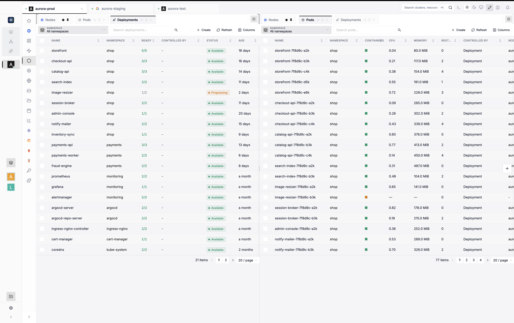

  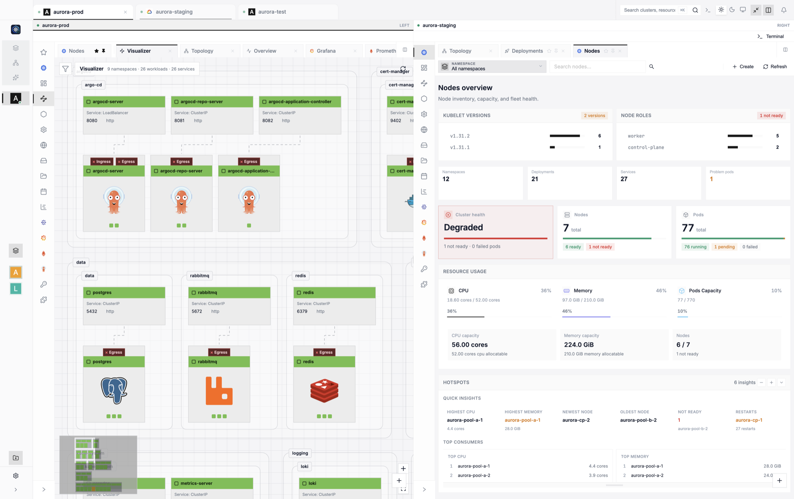

---

## Sparks

Sparks is a **local Markdown notebook** inside MagicLens — runbooks, incident notes, sketches, and reminders that stay on your disk. Nothing is uploaded. The vault is a folder of `.md` files you can open in Finder, back up, or move. Change the vault location or import a tree of Markdown from another folder.

Every note can attach to **global**, a **workspace**, a **cluster**, or a **resource** (kind + namespace + name). Open a Deployment and the Sparks tab already shows the notes that belong to it. The sidebar also lists resource **alarms** so an overdue PVC note is one click from the object.

  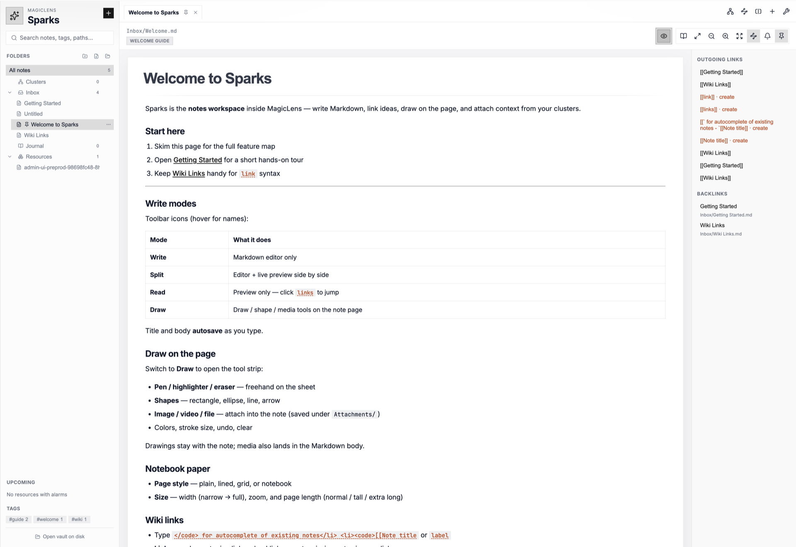

**Write like a notebook.** Three modes: Write (editor only), Split (editor + live preview), Read (rendered page — click `[[wiki links]]` to jump). Title, body, pin, and optional reminder sit on the note. Tabs stay open; pin a tab, drag to reorder. Search covers titles, tags, and paths.

**Folders.** Nested folders with a name, icon, or photo. Move notes by drag-and-drop (including back to the vault root). Deleting a folder that still has notes takes two confirmations so a whole runbook tree is not one mis-click.

**Wiki links & graph.** `[[Note title]]` creates an outgoing link. Missing links can create the note. The links panel shows outbound links and backlinks. **Graph** maps every note as a node — click a node to open it. Empty graph copy tells you to add `[[links]]` to grow the map.

  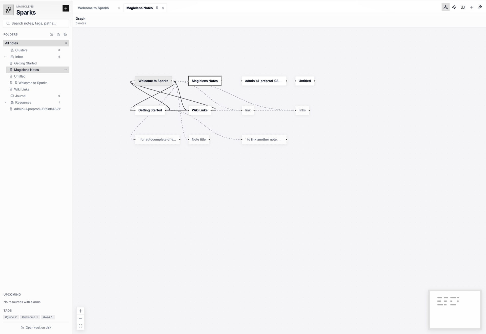

**Canvas.** A free board: drop note cards, stickies, and connections. Arrange incident timelines or architecture sketches spatially. Clear the board with a confirm.

**Draw on the page.** Switch the surface from Write to Draw: pen, highlighter, eraser, rectangle, ellipse, line, arrow, undo, clear. Attachments (photo, video, file) land in the note and on disk under the vault. Drawings stay with the Markdown — they do not leave the machine.

**Paper.** Lined, grid, or notebook backgrounds. Narrow / normal / wide / full width, zoom, and page length (normal / tall / extra long) so a long postmortem still feels like a page.

**Split layouts.** Single panel, two notes side by side, Note + Graph, Note + Canvas, or Graph + Canvas. Open a second note into the focused pane.

**Reminders.** Once, weekly, monthly, or specific dates. OS + in-app notification (keep MagicLens open). Weekly and monthly alarms keep firing until you clear them. Upcoming alarms appear in the sidebar; overdue items stay visible. Inbox collects pings.

**Themes.** Sparks has its own vault look — System (follows MagicLens), Paper, Parchment, Mono, Matcha, Ocean, Forest, Rose, Ink, Dusk, Nord, Solar, Ember. These do **not** change cluster tables or the rest of the app. Built-in modules (graph, canvas, …) can be toggled in Settings → Sparks.

  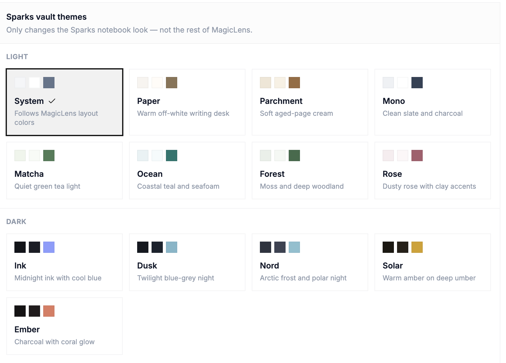

---

## VPN

Attach OpenVPN, Pritunl, or WireGuard profiles and link them to a cluster so connecting can bring the tunnel up. MagicLens can install or repair the OpenVPN Community CLI and WireGuard helpers (macOS uses Homebrew; OpenVPN Connect is not supported). PIN and MFA prompts stay in the app.

  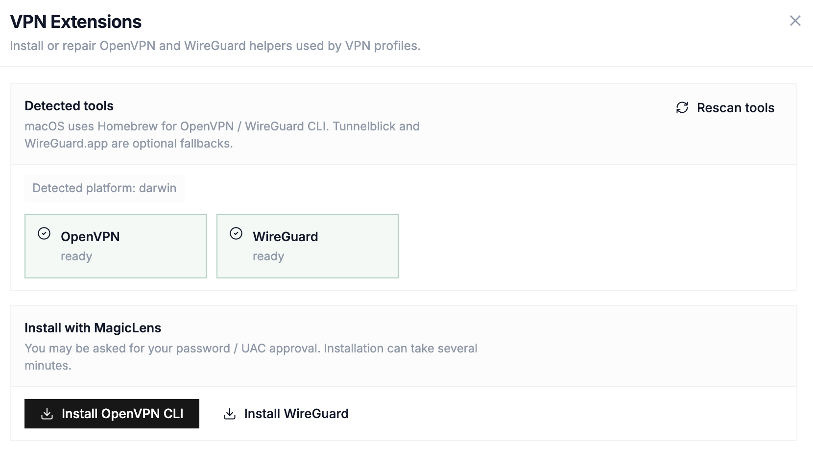

---

## Appearance & settings

Light, dark, or system theme. Built-in accents (White, Violet, Ocean, Forest, Sunset, …) plus named custom colours. UI fonts include Inter, Manrope, Plus Jakarta Sans, Outfit, and Sora.

Resource detail: right drawer, split panel, or bottom tab. Optional blur behind the drawer. Sidebar can hide Favorites or Workspaces. Language: English, Türkçe, Deutsch, Français, 日本語, 한국어, 中文.

App shortcuts cover search, split view, clusters, VPN, sidebar, and settings. Each workspace can have its own shortcut.

  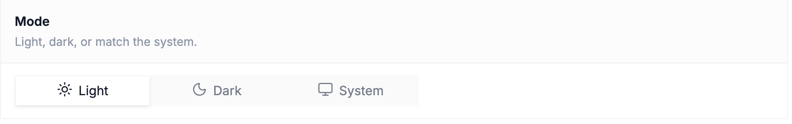

  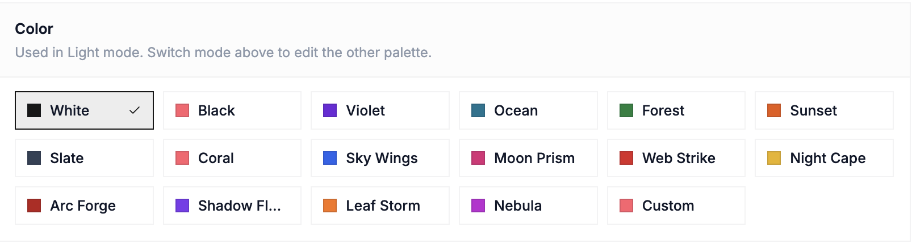

  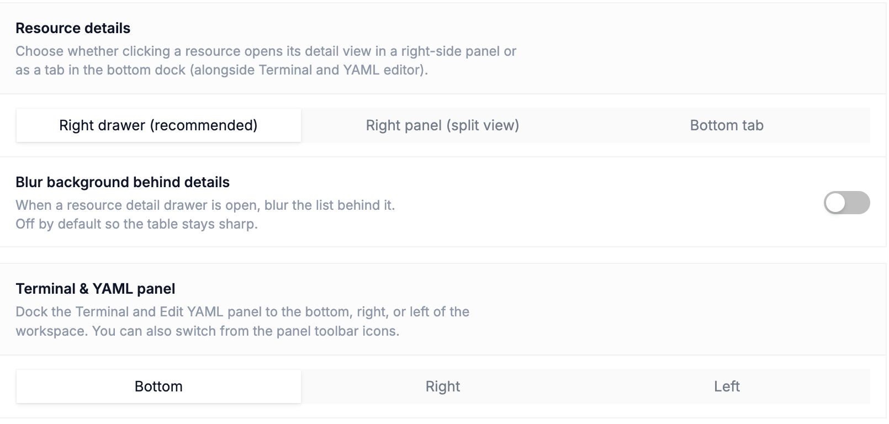

  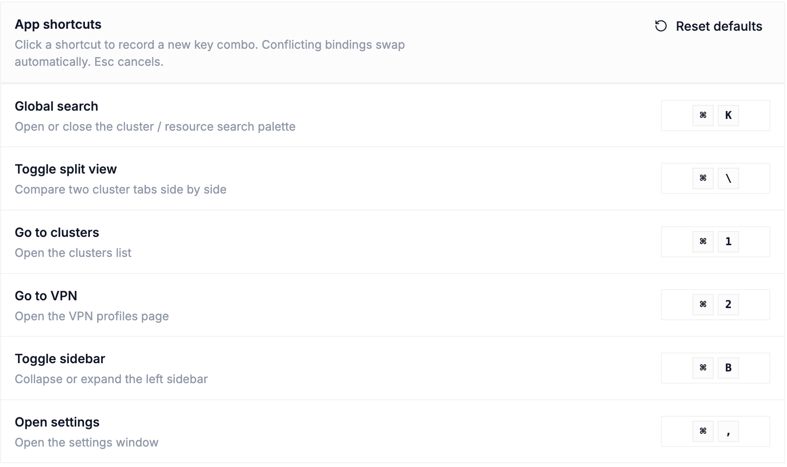

  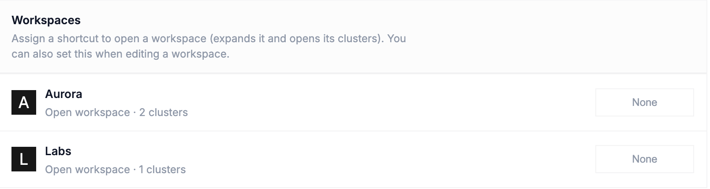

---

## macOS menu bar

A menu-bar icon opens a live panel for the clusters you pin. Each card can show health, CPU, memory, pods, pending / failed pods, and nodes. Page through three clusters at a time. Colour values amber above 75% and red above 90%. Stacked or side-by-side cards, compact rows, per-cluster accents, and a refresh interval while the panel is open. The tray can stay icon-only or show a live value from the first cluster.

  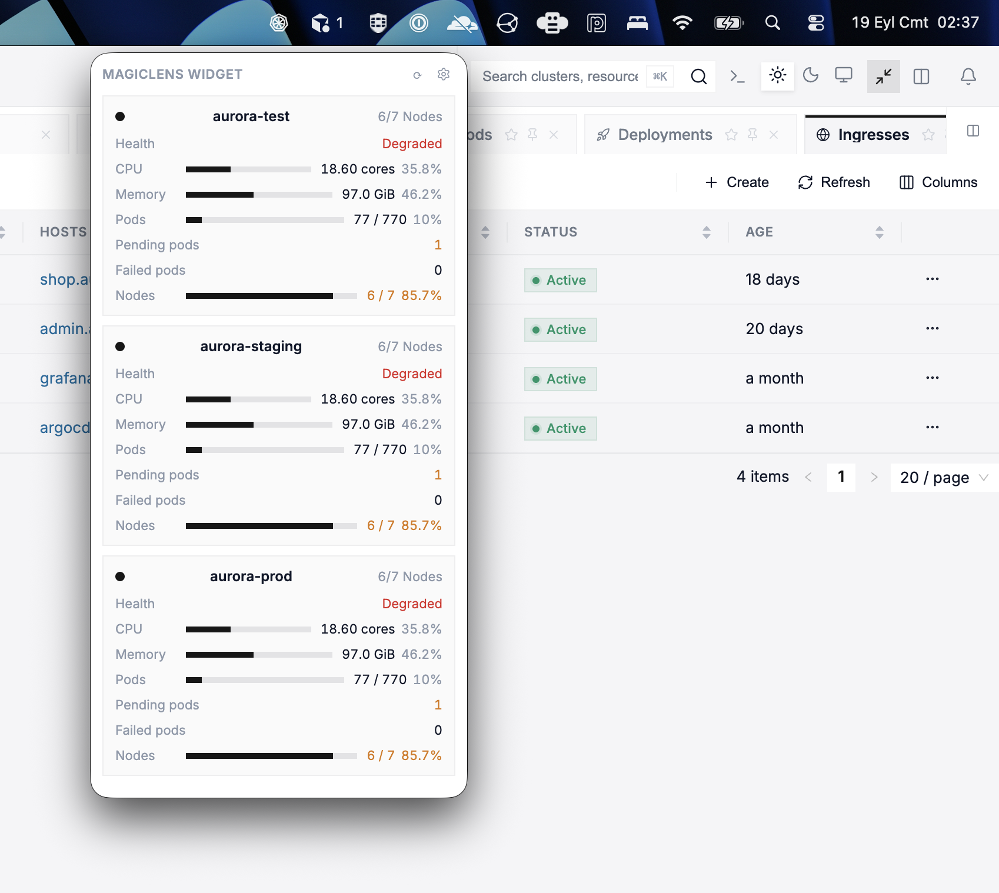

  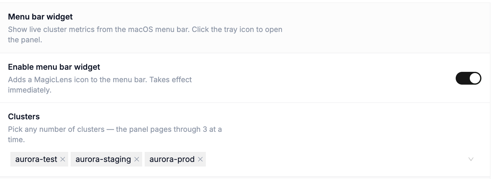

  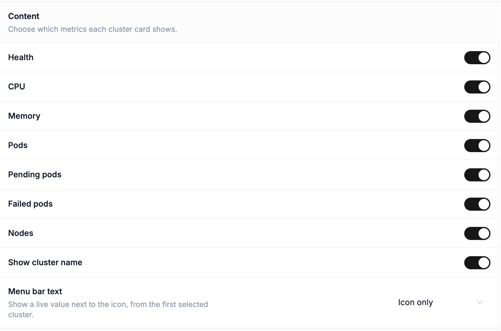

  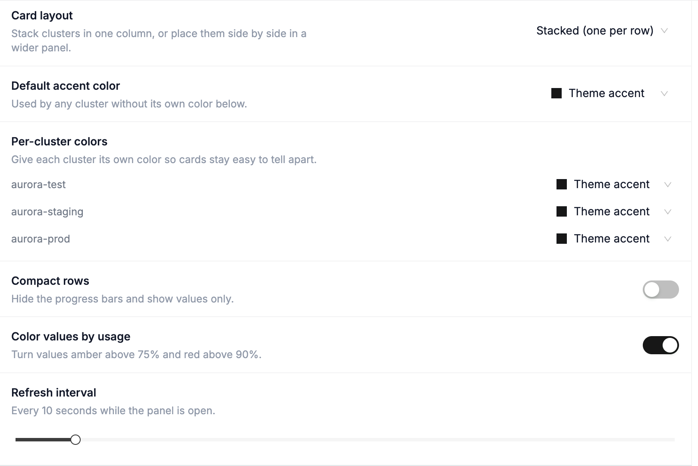

---

## Requirements

| Need | For |
| --- | --- |
| A kubeconfig on disk | Cluster access |
| metrics-server | Live CPU / memory on nodes and pods |
| Prometheus *(optional)* | History, node disks, PVC fullness (`kubelet_volume_stats_*`) |
| OpenVPN Community CLI or WireGuard *(optional)* | PIN + MFA tunnels — OpenVPN Connect is not supported |

UI languages: English, Türkçe, Deutsch, Français, 日本語, 한국어, 中文.

---

## Privacy

MagicLens uses your existing kubeconfig credentials against the cluster API. It does not upload cluster data to Magicorn unless you opt into a hosted account feature. Sparks notes stay in a folder on your disk.

---

## Support

Questions and issues: [support@magicorn.co](mailto:support@magicorn.co)

Installers and past versions: [github.com/magicorntech/magiclens/releases](https://github.com/magicorntech/magiclens/releases)
